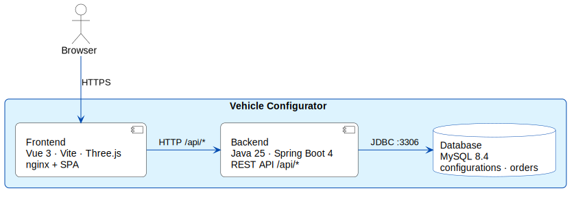

# Hi, I'm Frank Brase

**Hands-on Software Architect** designing and implementing software systems from embedded devices to cloud-connected applications.

I enjoy translating complex requirements into maintainable software architectures while staying close to the implementation.

---

## Areas of Expertise

### Software Architecture
- Software Architecture
- System Design
- Distributed Systems
- Embedded Architectures
- Cloud-Connected Systems
- Technical Leadership

### Embedded Software
- Modern C++ (C++17/20/23)
- C
- Rust
- Embedded Linux
- Yocto
- Zephyr RTOS
- Bare-Metal Development
- CAN

### Backend & Connectivity
- Python / Go / Java
- Spring Boot
- REST APIs
- GraphQL
- MQTT
- WebSockets
- Docker

### User Interfaces
- Qt / QML
- Flutter
- GTK4
- React

### AI-assisted Development
- GitHub Copilot
- Cursor
- Claude Code

---

## Engineering Showcases

This GitHub portfolio demonstrates software architecture through practical engineering showcases.

### [Vehicle Configurator](https://github.com/fbrase799/vehicle_configurator)

Classic **3-tier web application** — SPA frontend, stateless REST backend, relational database.  
Architecture: [ARCHITECTURE.md](https://github.com/fbrase799/vehicle_configurator/blob/main/ARCHITECTURE.md) · Live demo on demand via Azure Container Apps (`azure/01-setup.sh`).

| Ferrari | Overview | Purchase |
|:---:|:---:|:---:|
|  |  |  |

**Tech stack**

| Layer | Technologies | Highlights |
|-------|--------------|------------|
| **Frontend** | Vue 3, Vite, Three.js | Multi-step configurator, live **3D car preview** (WebGL), real-time price updates, shareable configuration URLs |
| **Backend** | **Java 25**, **Spring Boot 4**, JPA/Hibernate | REST API under `/api/*`, server-side price calculation, UUID-based configurations, transactional order submission |
| **Database** | MySQL 8.4 | Relational catalog, persisted configurations and orders; schema managed in SQL |
| **Infrastructure** | Docker Compose, Azure Container Apps, GitHub Actions | Same container images locally and in the cloud; CI/CD with OIDC federation |

**Architecture — three runtime components**

  

Source: <a href="./assets/diagrams/vehicle-configurator-containers.puml">PlantUML</a>

---

**Upcoming showcases:** Embedded Platform · Cloud-Connected Systems · Connectivity · Modern UI · AI-assisted Development

Each showcase covers problem statement, architecture decisions, design trade-offs, implementation, testing, and documentation.

---

## Certifications

- iSAQB CPSA-F – Certified Professional for Software Architecture
- Functional Safety (ISO 26262)
- Medical Devices (ISO 13485)
- GitHub Copilot – Generative AI

---

## Resume

The latest version of my resume is available here:

- [Frank_Brase_Resume.pdf](./assets/Frank_Brase_Resume.pdf)

---

## Connect

- LinkedIn: https://www.linkedin.com/in/frank-brase-6867133
- frank.brase@gmail.com